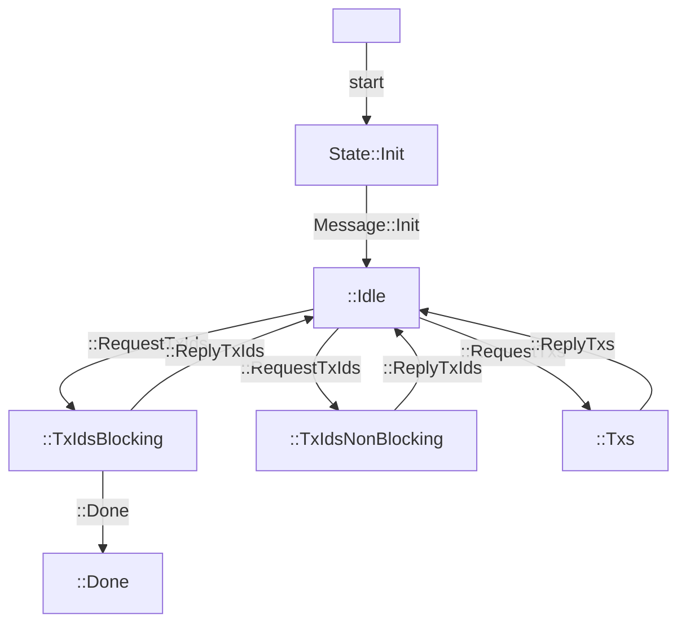

# TxSubmission

The TxSubmission miniprotocol allows a client with transactions to announce to connect to a server interested in those transactions.  This is used, for example, to propogate transactions in each nodes mempool from peer to peer, until they land on a node that is ready to mint a block.  Without this protocol, transactions wouldn't get minted until the node they were submitted to produced a block, which may be few and far between.

Initially, the design of this protocol seems backwards: you might expect the server to have the transactions, and the client to download them.  However, this design allows robust, two way congestion control: a node with transactions is not required to initiate a connection to anyone, and a node interested in transactions can pick and choose what they download.  The name of the miniprotocol, "TxSubmission" rather than "TxDownload", further reinforces this.

Like other miniprotocols, the client and server maintain a state machine between them; each message sent or received transitions the protocol into a new state, where either the client or server is expected to do some work.

The client is expected to initiate a connection and initialize the protocol into the Idle state. While in the Idle state, the client is waiting for the server to request either transaction IDs or transactions; Once the server makes a request, the client responds with the appropriate data.

These state transitions is captured in the mermaid diagram below:



This module provides two actors that implement either side of this role: Client and Server, each of which are detailed below.

## Client

You can instantiate a client like so
```rust
    let mut client = txsubmission::Client::new(channel4);
```

As the initiator, you then need to send a message to initialize the protocol
```rust
    client.send_init()?;
```

The server will then make a series of queries for available transaction Ids and transaction bodies, which you're responsible for handling:

```rust
    loop {
        match client.next_request()? {
            Request::TxIds(acknowledged, next) => {},
            Request::TxIdsNonBlocking(acknowledged, next) => {}
            Request::Txs(ids) => {}
        }
    }
```

When the server requests some number of transaction Ids, as the client you should reply with up to that many ids, and the size of the transaction.  In the non-blocking variant, you can return what you have immediately, while in the blocking variant you should wait until you can answer with the number requested by the server.  We provide some sample code below:

```rust
    Request::TxIdsNonBlocking(acknowledged, next) => {
        // NOTE: incomplete implementation, see below
        client.reply_tx_ids(
            // NOTE: we assume some kind of mempool implementation, which maintains a per-connection FIFO
            // this is not provided as part of pallas-miniprotocols
            mempool.iter()
                .take(next)
                .map(|tx| TxIdAndSize(tx.id(), tx.len()))
                .collect()
        )?;
    }
```

If the `acknowledged` field is nonzero, the server is letting you know that it either received or doesn't care about some of the previous transactions you sent, so you can advance the queue.  Thus, the above code should be extended to

```rust
    Request::TxIdsNonBlocking(acknowledged, next) => {
        // discards the first N transactions, advancing the queue for this client
        mempool.discard(acknowledged);
        client.reply_tx_ids(
            mempool.iter()
                .take(next)
                .map(|tx| TxIdAndSize(tx.id(), tx.len()))
                .collect()
        )?;
    }
```

When the server requests to download some transaction bodies, you can respond with the details of those transactions:

```rust
    Request::Txs(ids) => {
        let txs: Vec<TxBody> = mempool.find(ids);
        client.reply_txs(txs)?;
    }
```

Finally, if you decide to terminate the miniprotocol while waiting for enough transactions to respond to a blocking `Request::TxIds` request, you can send a Done message to gracefully terminate the protocol.

```rust
    client.send_done()?;
```

All together, this becomes:
```rust
    let mut client = txsubmission::Client::new(channel4);
    client.send_init()?;
    loop {
        match client.next_request()? {
            Request::TxIds(acknowledged, next) => {
                mempool.discard(acknowledged)?;
                if !mempool.wait_for_at_least(next)? {
                    client.send_done()?;
                    break;
                }
                client.reply_tx_ids(
                    mempool.iter()
                        .take(next)
                        .map(|tx| TxIdAndSize(tx.id(), tx.len()))
                        .collect()
                )?;
            },
            Request::TxIdsNonBlocking(acknowledged, next) => {
                mempool.discard(acknowledged)?;
                client.reply_tx_ids(
                    mempool.iter()
                        .take(next)
                        .map(|tx| TxIdAndSize(tx.id(), tx.len()))
                )?;
            }
            Request::Txs(ids) => {
                let txs = mempool.find(ids);
                client.reply_txs(txs)?;
            }
        }
    }
```

## Server

Conversely, you can instantiate a server ready to learn about new transactions like so

```rust
    let mut server = txsubmission::Server::new(channel4);
```

Since this is a client initiated protocol, you first need to wait to receive an initialization message:

```rust
    server.wait_for_init()?;
```

Then, you can begin querying for some number of transaction Ids

```rust
    server.acknowledge_and_request_ids(true, 0, 16)?;
```

And wait for a response
```rust
    match server.receive_next_reply()? {
        Reply::TxIds(ids_and_sizes) => { }
        Reply::Txs(txs) => { }
        Reply::Done => { }
    }
```

You can download those transactions with
```rust
server.request_txs(ids.iter().map(|tx_and_size| tx_and_size.0).collect());
```

After you receive some transaction Ids, if you request more you should acknowledge the ones you received

```rust
    server.acknowledge_and_request_ids(true, 16, 16)?
```

All-together, this event loop could look something like this:

```rust
    let mut server = txsubmission::Server::new(channel4);
    server.wait_for_init()?;
    let mut previous_count = 0;
    server.acknowledge_and_request_ids(true, previous_count, 16);
    loop {
        match server.receive_next_reply()? {
            Reply::TxIds(ids_and_sizes) => {
                server.request_txs(ids_and_sizes.iter().map(|tx| tx.0).collect())?;
            },
            Reply::Txs(txs) => {
                tx_channel.send(txs);
                server.acknowledge_and_request_ids(true, txs.len(), 16)?;
            },
            Reply::Done => {
                break;
            }
        }
    }
```