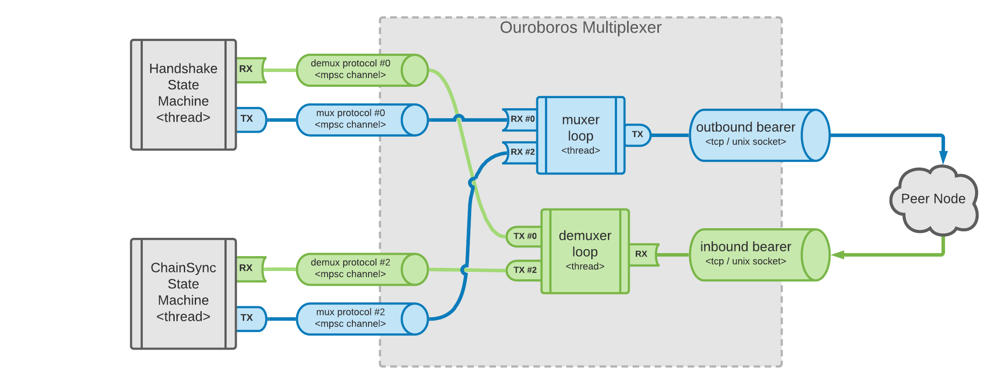

# Pallas Multiplexer

This is an implementation of the Ouroboros multiplexer logic as defined in the [The Shelley Networking Protocol](https://hydra.iohk.io/build/1070091/download/1/network.pdf#chapter.3) specs.

## Architectural Decisions

The following architectural decisions were made for this particular Rust implementation:

- each mini-protocol state machine should be able to work in its own thread
- a bounded queue should serve as buffer to decouple mini-protocol logic from multiplexer work
- the implementation should pipelining-friendly, even if we don't have a current use-case
- the multiplexer should be agnostic of the mini-protocols implementation details.

## Implementation Details

Given the above definitions, Rust's _mpsc channels_ seem like the correct artifact to orchestrate the communication between the different threads in the multiplexer process.

The following diagram provides an overview of the components involved:



## Usage

The following code provides a very rough example of how to setup a client that connects to a node and spawns two concurrent threads running independently, both communication over the same bearer using _Pallas_ multiplexer.

```rust
// Setup a new bearer. In this case, we use a unix socket to connect
// to a node running on the local machine.
let bearer = UnixStream::connect("/tmp/pallas").unwrap();

// Setup a new multiplexer using the created bearer and a specification
// of the mini-protocol IDs that we'll be using for our session. In this case, we
// pass id #0 (handshake) and #2 (chainsync).
let muxer = Multiplexer::setup(tcp, &[0, 2])

// Ask the multiplexer to provide us with the channel for the miniprotocol #0.
let mut handshake = muxer.use_client_channel(PROTOCOL_N2N_HANDSHAKE);

// Spawn a thread and pass the ownership of the channel.
thread::spawn(move || {
    // Deconstruct the channel to get a handle for sending data into the muxer
    // ingress and a handle to receive data from the demuxer egress.
    let Channel(mux_tx, demux_rx) = handshake;

    // Do something with the channel. In this case, we just keep sending
    // dumb data every 50 millis.
    loop {
        let payload = vec![1; 65545];
        tx.send(payload).unwrap();
        thread::sleep(Duration::from_millis(50));
    }
});

// Ask the multiplexer to provide us with the channel for the chainsync miniprotocol.
let mut chainsync = muxer.use_client_channel(PROTOCOL_N2N_CHAINSYNC);

// Spawn a different thread and pass the ownership of the 2nd channel.
thread::spawn(move || {
    // Deconstruct the channel to get a handle for sending data into the muxer
    // ingress and a handle to receive data from the demuxer egress.
    let Channel(mux_tx, demux_rx) = chainsync;
    
    // Do something with the channel. In this case, we just print in stdout
    // whatever get received for this mini-protocol.
    loop {
        let payload = rx.recv().unwrap();
        println!("id:{protocol}, length:{}", payload.len());
    }
});
```

## Run Examples

For a working example of a two peers communicating (a sender and a listener), check the [examples folder](examples). To run the examples, open two different terminals and run a different peer in each one:

```sh
# on terminal 1, start the listener
RUST_LOG=info cargo run --example listener
```

```sh
# on terminal 2, start the sender
RUST_LOG=info cargo run --example sender
```

## Real World Usage

For a more complex, real-world example, check the [Oura](https://github.com/txpipe/oura) repo, it provides a full-blown client tool designed to live-stream block data from a local or remote node.