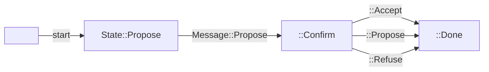

# Handshake

The Handshake miniprotocol allows a client and server to negotiate a specific protocol version and set of parameters.  Note: the specification refers to these as "protocol parameters", but this should not be confused with the usual notion of "protocol parameters" used by the Cardano ledger.

The Handshake miniprotocol is the first protocol to run when a connection opens; in fact, in rare cases, two nodes may connect to eachother simultaneously.  This is known as a "simultaneous TCP open", and the protocol is designed to be robust to this.

This miniprotocol simulates a very simple state machine with three states, seen in the mermaid diagram below:



There are separate versions of this protocol depending on whether you're communicating between two nodes over TCP, or between a node and a local process, via a unix socket.

This module provides two actors that implement either side of this role: Client and Server, each of which are detailed below.

## Client

You can instantiate a client like so
```rust
    let mut n2n_client = handshake::N2NClient::new(channel0);
    let mut n2c_client = handshake::N2CClient::new(channel0);
```

As the initiator, you then propose a set of versions you are aware of:
```rust
    // Note: Other helper methods exist as well
    n2n_client.send_propose(handshake::n2n::VersionTable::v7_and_above(MAINNET_MAGIC))?;
```

The server will then respond, either indicating which version they accept, or an outright refusal:

```rust
    match n2n_client.recv_while_confirm()? {
        Confirmation::Accepted(version, parameters) => {},
        Request::Rejected(reason) => {}
    }
```

For convenience, these two steps are wrapped in a `handshake` helper method:
```rust
    n2n_client.handshake(handshake::n2n::VersionTable::v7_and_above(MAINNET_MAGIC))?;
```

Putting this all together, it looks something like this:

```rust
    let mut client = handshake::N2NClient::new(channel0);
    client.handshake(handshake::n2n::VersionTable::v7_and_above(MAINNET_MAGIC))?;
```

## Server

Conversely, you can instantiate a node to node or node to client server ready to shake hands like so

```rust
    let mut n2n_server = handshake::N2NServer::new(channel0);
    let mut n2c_server = handshake::N2NServer::new(channel0);
```

You should first recieve the set of versions that the client is proposing:

```rust
    let versions = n2n_server.receive_proposed_versions()?;
```

Then, you can select one that you understand, and accept it, or refuse the handshake:

```rust
    // NOTE: in practice, your version selection is probably more complicated than this
    if let Some(params) = versions.values.get(7) {
        n2n_server.send_accept_version(7, params)?;
    } else {
        n2n_server.send_refuse(RefuseReason::VersionMismatch(vec![7]))?;
    }
```

All-together, this might look something like:

```rust
    let mut server = handshake::N2NServer::new(channel0);
    let versions = server.receive_proposed_versions()?;
    if let Some(params) = versions.values.get(7) {
        server.send_accept_version(7, params)?;
    } else {
        server.send_refuse(RefuseReason::VersionMismatch(vec![7]))?;
    }
```